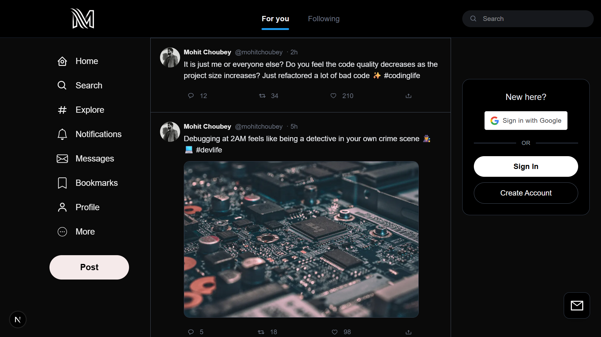

# Twitter(X.com) -Clone  (Full-Stack)

## A full-stack Twitter-like social media application built with Next.js (Frontend) and Node.js + GraphQL (Backend).
### The project focuses on modern frontend practices, GraphQL-based APIs, authentication, and scalable backend architecture.

## Screenshot:-

  

## **Tech Stack**
### **Frontend**

- Next.js 16
- React 19
- Apollo Client
- GraphQL
- Tailwind CSS
- React Icons
- Google OAuth
- GraphQL Code Generator

### **Backend**
- Node.js
- Express
- Apollo Server (GraphQL)
- Prisma ORM
- PostgreSQL
- JWT Authentication
- TypeScript

### Project Structure
root/
│
├── frontend/
│   ├── app / pages
│   ├── components
│   ├── graphql
│   ├── codegen.ts
│   ├── package.json
│   └── tailwind.config.ts
│

├── backend/
│   ├── src/
│   │   ├── index.ts
│   │   ├── graphql/
│   │   ├── resolvers/
│   │   └── services/
│   ├── prisma/
│   │   └── schema.prisma
│   ├── package.json
│   └── tsconfig.json
│
└── README.md

## Features:-

- User authentication using Google OAuth
- JWT-based secure sessions
- GraphQL API with Apollo Server
- Prisma ORM with PostgreSQL
- Real-time-ready architecture
- Modern Twitter-style feed UI
- GraphQL code generation for type safety
- Scalable and clean project structure

Frontend Setup
cd frontend
yarn install
yarn dev

## Frontend will run on:

http://localhost:3000

Available Scripts

yarn dev – Start development server

yarn build – Build for production

yarn start – Run production build

yarn lint – Lint code

yarn codegen – Generate GraphQL types

For Backend - https://github.com/mohitvashu1/M-server